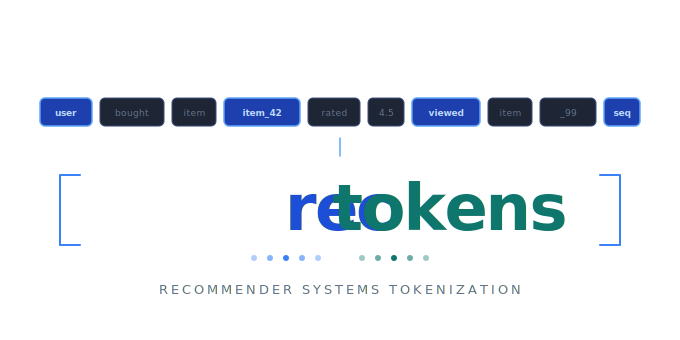
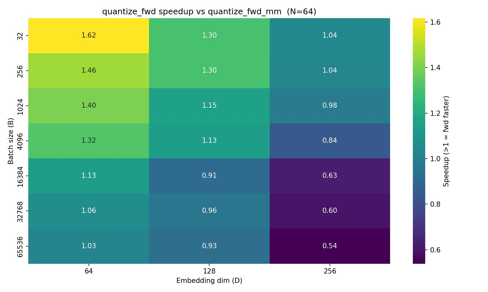
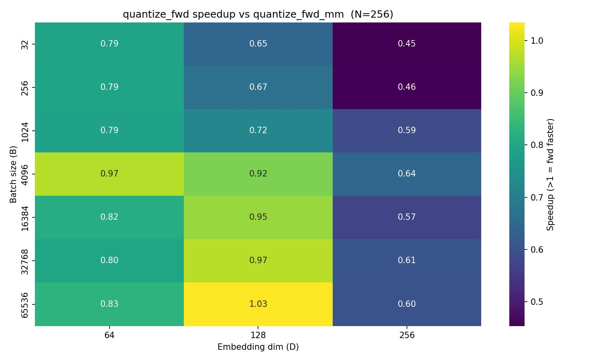
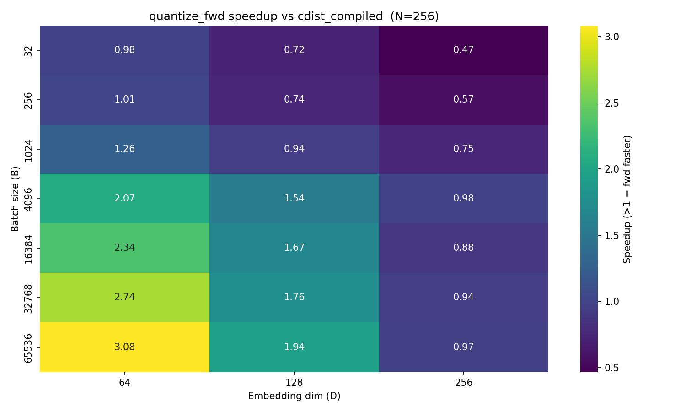
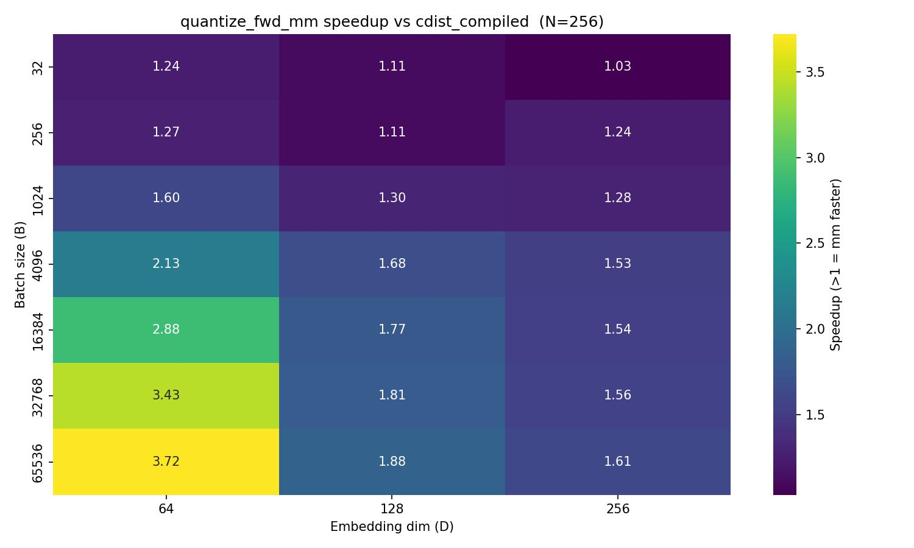
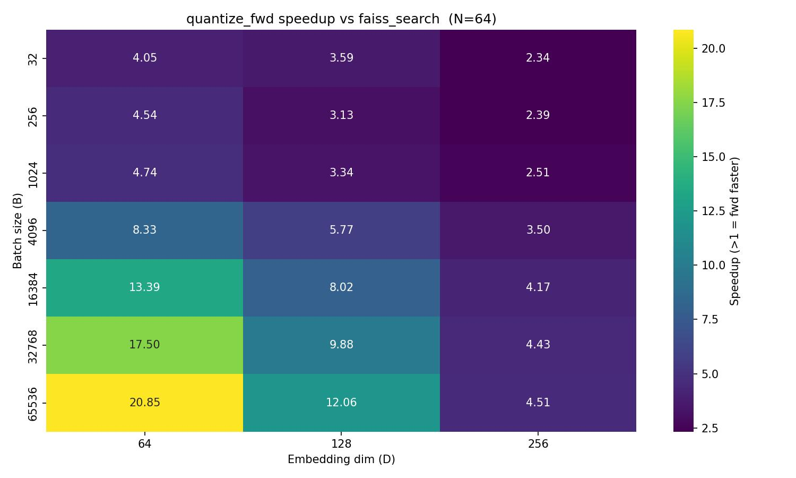
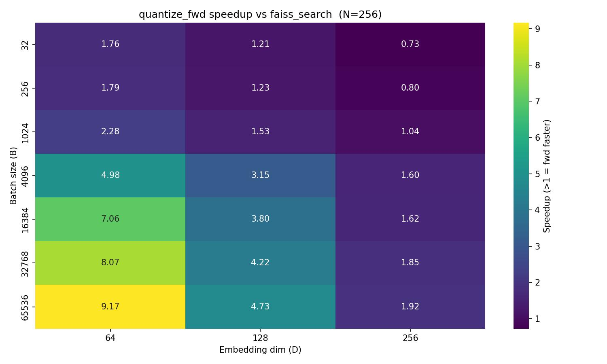
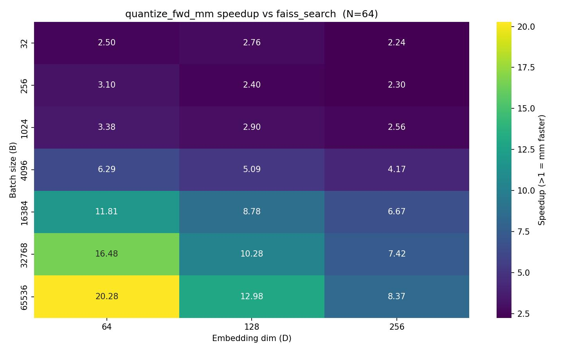
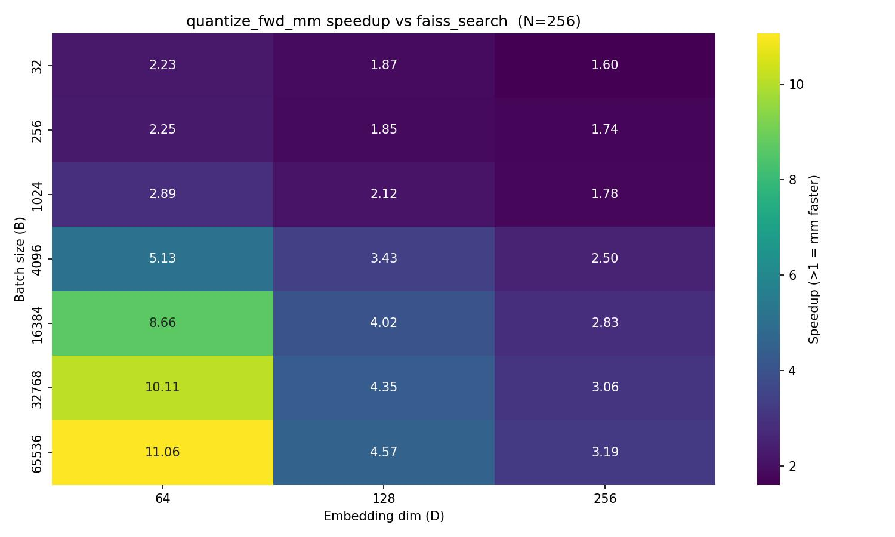

<p align="center">
  
</p>

# RecTokens

A tokenizer library for sequential recommendation systems. RecTokens converts continuous item embeddings into discrete multi-level token sequences using **Residual Quantization (RQ)**, enabling large item catalogs to be represented as compact token IDs suitable for autoregressive Transformer-based recommendation models.

## Overview

Modern sequential recommendation models treat item retrieval as a language modeling problem: given a user's interaction history, generate the next item's token sequence autoregressively. RecTokens provides three components for this pipeline:

1. **Tokenizers** — Convert item feature vectors into discrete token sequences (item IDs).
2. **Constrained Decoding** — At inference time, efficiently restrict the model's generation to only valid item token sequences.
3. **HuggingFace Integration** — Plug item tokens directly into any pretrained LLM from HuggingFace. `ItemAwareTokenizer` extends an HF text tokenizer with item-level tokens, `resize_and_initialize` adapts the model's embedding table, and `InterleavedSequenceCollator` / `PrecomputedSequenceCollator` prepare mixed text+item batches for standard HF `Trainer` fine-tuning. This lets you fine-tune models like Qwen on recommendation sequences with minimal boilerplate.

### Residual Quantization

RQ encodes a `D`-dimensional embedding as `L` discrete codes, one per level:

```
r_0 = x
code_l, q_l = quantizer_l.encode(r_{l-1})
r_l = r_{l-1} - q_l     (residual)
```

With `K` codes per level and `L` levels, the scheme supports `K^L` unique item IDs. For example, `K=256, L=3` yields 16.7 million possible item IDs.

## Installation

```bash
pip install -e .

# With development dependencies
pip install -e ".[dev]"
```

**Requirements:** Python ≥ 3.10, PyTorch ≥ 2.0, NumPy ≥ 1.24. CUDA is required for constrained decoding with GPU kernels.

## End-to-End Workflow

This section walks through the full pipeline for training a generative recommendation model on the Amazon Reviews dataset.

### Step 0 — Data

`AmazonReviews` (in `examples/data/amazon.py`) auto-downloads and processes the dataset on first use. Point `--root` to an empty directory and the data will be downloaded there.

Supported `--split` values: `beauty`, `sports`, `toys`.

### Step 1 — Train an item tokenizer

Choose **RQKMeans** (fast, no GPU required) or **RQVAE** (better reconstruction, requires GPU).

**RQKMeans:**
```bash
python scripts/training/train_rqkmeans.py \
    --root data/amazon --split beauty \
    --num_levels 3 --codebook_size 256 \
    --num_epochs 20 --batch_size 640 \
    --save_every 5 --output_dir checkpoints/rqkmeans
# → checkpoints/rqkmeans/final.pt
```

**RQVAE:**
```bash
python scripts/training/train_rqvae.py \
    --root data/amazon --split beauty \
    --latent_dim 64 --hidden_dim 512 \
    --num_levels 3 --codebook_size 256 \
    --num_epochs 100 --batch_size 640 --lr 1e-3 \
    --save_every 10 --output_dir checkpoints/rqvae
# → checkpoints/rqvae/final.pt
```

### Step 2 — Precompute interleaved sequences

Encode all item embeddings once with the fitted tokenizer and assemble the flat token-ID sequences for every user (text tokens + semantic ID tokens). This avoids repeated neural-network inference during training.

```bash
python precompute_sequences.py \
    --root data/amazon --split beauty \
    --seq_splits train,eval \
    --item_tok_path checkpoints/rqvae/final.pt \
    --item_tok_type rqvae \
    --num_levels 3 --codebook_size 256 \
    --model_name Qwen/Qwen3.5-2B \
    --max_seq_len 20 \
    --output_dir data/precomputed/beauty
# → data/precomputed/beauty/beauty_train.pt
# → data/precomputed/beauty/beauty_eval.pt
```

Key flags:
- `--item_tok_type` — `rqvae` (default) or `rqkmeans`
- `--seq_splits` — comma-separated list: `train`, `eval`, `test`
- `--include_future` — append the held-out future item to each sequence
- `--batch_size` — batch size for item embedding encoding (default 512)

### Step 3 — Finetune Qwen on precomputed sequences

```bash
python finetune_qwen.py \
    --model_name Qwen/Qwen3.5-2B \
    --precomputed_path data/precomputed/beauty/beauty_train.pt \
    --precomputed_eval_path data/precomputed/beauty/beauty_eval.pt \
    --num_levels 3 --codebook_size 256 \
    --batch_size 8 --grad_accum 4 \
    --num_epochs 3 --lr 2e-4 \
    --max_length 512 --loss_on all \
    --bf16 --gradient_checkpointing \
    --save_every 500 --eval_every 500 \
    --output_dir checkpoints/qwen \
    --wandb_project my-project --wandb_run_name beauty-run
# → checkpoints/qwen/final/
```

Key flags:
- `--loss_on` — `all` (default), `items`, or `text`
- `--bf16` / `--gradient_checkpointing` — recommended for GPU training
- `--wandb_project` / `--wandb_run_name` — optional W&B logging (omit for no logging)
- `--precomputed_eval_path` — if provided, enables mid-training evaluation

## Tokenizers

### RQKMeansTokenizer

Fits codebooks via mini-batch K-means. No training loop required — call `fit_step` on batches of embeddings, then encode.

```python
from rectokens.tokenizers.rq_kmeans import RQKMeansTokenizer
from rectokens.datasets import NumpyDataset
import numpy as np

data = np.random.randn(10_000, 128).astype("float32")
dataset = NumpyDataset(data)

tokenizer = RQKMeansTokenizer(
    num_levels=3,       # number of RQ levels (token sequence length)
    codebook_size=256,  # codes per level
    dim=128,            # embedding dimension
)

for batch in dataset.iter_batches(batch_size=256):
    tokenizer.fit_step(batch)

import torch
features = torch.randn(8, 128)
tokens = tokenizer.encode(features)   # TokenSequence, codes shape: (8, 3)
reconstructed = tokenizer.decode(tokens)  # Tensor shape: (8, 128)

tokenizer.save("tokenizer.pt")
tokenizer = RQKMeansTokenizer.load("tokenizer.pt")
```

### RQVAETokenizer

Learns tokenization end-to-end via an encoder–quantizer–decoder architecture. Uses a Vector Quantization (VQ) objective with EMA codebook updates and a dead-code restart mechanism.

```python
from rectokens.tokenizers.rqvae import RQVAETokenizer
import torch
import torch.nn.functional as F

tokenizer = RQVAETokenizer(
    input_dim=128,
    latent_dim=64,
    hidden_dim=256,
    num_levels=3,
    codebook_size=256,
    commitment_weight=0.25,
    ema_decay=0.99,
)

optimizer = torch.optim.Adam(tokenizer.parameters(), lr=1e-3)

for batch in data_loader:
    out = tokenizer(batch)
    loss = F.mse_loss(out.recon, batch) + out.commitment_loss
    optimizer.zero_grad()
    loss.backward()
    optimizer.step()

tokenizer._fitted = True
tokenizer.eval()

tokens = tokenizer.encode(features)
reconstructed = tokenizer.decode(tokens)

tokenizer.save("tokenizer.pt")
tokenizer = RQVAETokenizer.load("tokenizer.pt")
```

The `forward` pass returns an `RQVAEOutput` NamedTuple with fields `recon` (reconstruction), `commitment_loss`, `codes`, and `p_unique_ids` (fraction of distinct token tuples in the batch).

## Constrained Decoding

At inference time, a recommendation model must generate token sequences that correspond to actual items in the catalog. RecTokens provides a GPU-accelerated trie for this constraint.

### CompactCSRTrie

A trie over all valid item token sequences, stored in Compressed Sparse Row (CSR) format for efficient GPU tensor operations. The first few layers use dense lookup tables for O(1) indexing; deeper layers use sparse CSR traversal.

```python
from rectokens.schemas.compact_csr_trie import CompactCSRTrie

# Build from the codes tensor of all items
sem_ids = tokenizer.encode(all_item_features)
trie = CompactCSRTrie.from_sorted_batch(
    sem_ids.codes,
    vocab_size=256,
    dense_lookup_layers=2,
)
```

### Autoregressive Generation

```python
from rectokens.decoding.constrained_decoding import autoregressive_generate
from rectokens.schemas.config import GenerationConfig

config = GenerationConfig(
    steps=3,       # token sequence length
    k=10,          # number of items to retrieve
    beam_size=50,  # beam width
    temperature=1.0,
)

# model: any nn.Module whose forward returns logits over the vocab
generated = autoregressive_generate(
    model=model,
    trie=trie,
    input_ids=user_history_ids,
    generation_config=config,
)
# generated shape: (B, k, steps)
```

### Constrained Node Transition

The core primitive for constrained decoding is a masked linear projection. Two implementations are provided:

- **`vtnk_pytorch`** — Pure PyTorch; applies a validity mask to logits before sampling.
- **`fused_linear_constrained_node_transition`** — Custom Triton kernel that fuses the matrix multiply and constraint masking into a single GPU kernel for maximum throughput.

## Performance

The `benchmark_vtnk.py` script benchmarks constrained decoding implementations across batch sizes (`B ∈ {32, 256, 1024}`) and vocabulary sizes (`N ∈ {512, 1024, 8192, 150000}`). The fused Triton kernel provides 10–100× speedup over CPU trie traversal at large vocabulary and batch sizes.

```bash
python scripts/benchmark/benchmark_vtnk.py
# Results saved to out/heatmap_*.jpg
```

### Fused Kernel Speedup Heatmaps

This section benchmarks `fused_linear_constrained_node_transition` — the kernel that fuses the linear projection and CSR trie constraint into a single GPU pass — against four baselines. Each heatmap reports the speedup ratio (values > 1 mean the fused kernel is faster) across batch sizes (B ∈ {32, 256, 1024}) and vocabulary sizes (N ∈ {512, 1024, 8192, 150000}), with hidden dim K=512 fixed.

**Summary of findings.** The fused kernel consistently outperforms all GPU baselines at large vocabulary sizes (N ≥ 8192) and its advantage grows with both N and B. At N=150k the fused kernel is **6–8× faster** than the two-kernel approach (separate matmul + constraint pass) and **6–7.6× faster** than the dense PyTorch baseline, because fusing the linear projection and CSR mask into a single Triton kernel eliminates the intermediate logit buffer and the second kernel-launch overhead — costs that scale directly with N×B. Against sparse PyTorch the advantage is more modest (1.4–3.9×) and narrows at large N + large B, since sparse PyTorch already skips a large fraction of the matmul work; the fused kernel is most effective relative to this baseline at small-to-medium vocab (N ≤ 8192).

At small vocabulary (N ≤ 1024) the fused kernel is **slower** than the two-kernel approach (0.24–0.75×). Here the matmul is small enough that cuBLAS (used by `torch.compile(nn.Linear)`) outperforms the hand-written Triton tile, and the savings from avoiding a second kernel launch do not compensate.

Against CPU trie traversal the fused kernel wins by **17–625×**, with the largest margins at large batch sizes where the CPU baseline scales linearly with B while the GPU kernel processes the entire batch in parallel. The speedup narrows at N=150k (17–95×) as GPU compute time grows, but the fused kernel remains the clear winner across the board.

**vs PyTorch (dense)** — `torch.compile(nn.Linear)` followed by `vtnk_pytorch`, which applies a validity mask to the logits in a separate GPU pass after the matmul.


**vs Sparse PyTorch** — `torch.compile(sparse_linear_pytorch)`, which skips columns corresponding to invalid tokens during the matmul using a sparse weight representation, but remains within the PyTorch runtime.


**vs Custom Kernel** — `torch.compile(nn.Linear)` followed by `constrained_node_transition`, a standalone Triton kernel that applies the CSR trie mask to precomputed logits. The matmul and masking are still two separate kernel launches.


**vs CPU Trie** — Pure Python traversal of an in-memory `Trie` on CPU, iterating over each batch item to collect valid next tokens. Included as the reference baseline for the constrained decoding problem.


## Nearest-Neighbor Quantization Kernels

The core operation in residual quantization is finding the nearest codebook entry for each embedding vector — a `(B, D) × (N, D)` nearest-neighbor search returning `B` integer indices. RecTokens provides four implementations, benchmarked across batch sizes `B ∈ {32, …, 65536}`, embedding dims `D ∈ {64, 128, 256}`, and codebook sizes `N ∈ {64, 128, 256, 512}`.

### Summary of takeaways

- **`quantize_fwd_mm` is the default choice for N ≥ 128.** Its matrix-multiply tile structure maps well onto GPU SIMD for any batch size, and its lead widens as both N and D grow. It beats `cdist_compiled` at every point in the benchmark grid for N ≥ 128, and beats FAISS-GPU at every point regardless of N.
- **`quantize_fwd` wins only at N ≤ 64.** Its sequential-scan approach is efficient when the inner loop over N is short enough that tiling overhead is not yet amortized. At N=64 and small batch it is up to 1.6× faster than `quantize_fwd_mm`.
- **The crossover between `fwd` and `mm` is governed by N × D.** At small N the sequential scan wins; as N grows the scan's serial inner loop becomes the bottleneck and the MM tile kernel pulls ahead. Higher D accelerates this crossover.
- **`cdist_compiled` is a reasonable fallback** — simpler to deploy than Triton kernels, and its cost grows predictably with B×N. It is however consistently slower than `quantize_fwd_mm` and loses to `quantize_fwd` at small D.
- **FAISS-GPU (search only, pre-built index) is the slowest implementation across virtually all settings.** Its per-call dispatch overhead dominates at small N and large B. The only region where it is marginally competitive is large N (≥ 256) combined with large D (256) and very small batch (B ≤ 256) — a regime uncommon in production rec systems. The Triton kernels are otherwise 2–21× faster.
- **All implementations benefit from large B, but the Triton kernels benefit most.** Their speedup over FAISS and cdist grows monotonically with batch size because they achieve near-linear GPU utilization scaling while FAISS's fixed dispatch cost remains constant.

### Kernel descriptions

#### `quantize_fwd` — Triton sequential scan

Each Triton block handles one or more rows of `x` and iterates over the full codebook of size N in sequence, accumulating the minimum L2 distance in registers.

**Strengths:** Very low launch overhead; minimal shared memory pressure; optimal at N ≤ 64 where the inner loop is short; memory access pattern is sequential and cache-friendly.

**Weaknesses:** The inner loop over N is serial within each thread block, so kernel time scales linearly with N. At large N or large D the kernel stalls waiting for memory, and the MM-style kernel's parallelism over N tiles wins decisively. At N=512, D=256, `fwd` is over 3× slower than `mm`.

#### `quantize_fwd_mm` — Triton MM-style tiled kernel

Reformulates the L2 nearest-neighbor problem as a matrix multiplication over B×N tiles. Multiple thread blocks cooperate over the N dimension in parallel.

**Strengths:** Strong GPU utilization at any (B, N, D) combination; tiling amortizes launch overhead effectively; consistently fastest at N ≥ 128; no failure modes — it always beats FAISS.

**Weaknesses:** Higher launch overhead and shared memory pressure than the sequential kernel; slight disadvantage at N ≤ 64 + small batch where the tile setup cost is not yet amortized.

#### `cdist_compiled` — `torch.compile(torch.cdist + argmin)`

Computes the full pairwise distance matrix `(B, N)` using `torch.cdist`, then takes `argmin` along N. Compiled with `torch.compile` for fused kernel dispatch.

**Strengths:** Zero external dependencies beyond PyTorch; leverages cuBLAS for the pairwise distance core; D-insensitive performance because the matmul is fully blocked.

**Weaknesses:** Allocates an intermediate `(B, N)` distance buffer that grows with both B and N; two-pass execution (matmul then argmin) prevents full fusion. Consistently slower than both Triton kernels at large B, and loses to `quantize_fwd` at small D.

#### `faiss_search` — FAISS-GPU flat L2 (pre-built index)

Uses a FAISS `IndexFlatL2` GPU index built once from the codebook (`make_gpu_index`) and queried at inference time with `index.search(x, 1)`.

**Strengths:** Battle-tested implementation; plugs into the broader FAISS ecosystem for approximate search extensions; cuBLAS-backed distance computation is highly optimized for large D.

**Weaknesses:** Large per-call dispatch overhead even on GPU, not amortized at small N or large B. The Triton kernels are 2–21× faster across the benchmark grid. Only marginally competitive at N ≥ 256, D=256, and B ≤ 256 — a narrow corner of the operating space.

### Benchmark setup

```bash
python scripts/benchmark/benchmark_nn_quantize.py
# CSV results: out/bench_nn_quantize_N{N}.csv
# Heatmaps:    out/heatmap_*.jpg
```

Grid: `B ∈ {32, 256, 1024, 4096, 16384, 32768, 65536}`, `D ∈ {64, 128, 256}`, `N ∈ {64, 128, 256, 512}`. Heatmap axes are batch size (B, rows) vs embedding dim (D, columns). Speedup values > 1 mean the left-hand kernel is faster. All FAISS timings exclude index build time (static codebook).

### Heatmaps

#### `quantize_fwd` vs `quantize_fwd_mm`

**N=64 — `fwd` leads at small batch and low D, `mm` takes over at large D or large B**



At N=64 the sequential scan is fast enough to outrun the MM tile kernel across most of the grid. `quantize_fwd` is up to 1.62× faster at (B=32, D=64), where the tile setup overhead of `mm` is not yet amortized and the codebook is small enough that the serial inner loop completes quickly. The advantage decays along two axes: increasing D multiplies the per-row scan cost, and increasing B eventually saturates the GPU such that the parallel tile structure of `mm` becomes the more efficient fit. At D=256 the advantage collapses entirely: `fwd` falls to 0.54–0.84× of `mm` for large B. The crossover diagonal runs from (small B, high D) to (large B, low D). For N=64 with D ≤ 128 and B ≤ 4096, `fwd` is the faster choice.

**N=256 — `mm` dominates; `fwd` never recovers**



With N=256 the sequential inner loop in `quantize_fwd` is 4× longer than at N=64, and the MM tile kernel's parallel decomposition over N fully materializes. `fwd` is slower at nearly every cell, ranging from 0.45× (B=32, D=256 — more than 2× slower) to a single near-parity cell at (B=65536, D=128: 1.03×). The D=256 column is universally dark: 0.45–0.61× regardless of batch size. The gradient along the D axis is the dominant signal — wider embeddings amplify the per-row scan cost linearly while the MM kernel's tile width absorbs the extra work with no additional penalty. At N=256 and above, `quantize_fwd_mm` is unambiguously the correct choice.

#### `quantize_fwd` vs `cdist_compiled`

**N=256 — `fwd` wins at small D with growing margin, but loses at large D + small batch**



At D=64, `quantize_fwd` beats `cdist_compiled` at every batch size (0.98–3.08×), and the speedup grows monotonically with B — as the batch size grows the Triton kernel's per-row parallelism scales efficiently while `cdist`'s two-pass (matmul + argmin) dispatch cost amortizes more slowly. At D=128 the advantage shrinks to 0.72–1.94× and is only reliable for B ≥ 1024. At D=256, `fwd` loses at small batch (0.47–0.75× for B ≤ 256) and barely reaches parity at the largest batch sizes (B=65536, 0.97×). This failure at high D reflects the sequential kernel's sensitivity to embedding width: `cdist` delegates to a cuBLAS batched matmul that remains equally efficient regardless of D, while `fwd`'s inner loop cost grows with D. For N=256 and D=256, `cdist_compiled` is actually preferable to `quantize_fwd` at small batch.

#### `quantize_fwd_mm` vs `cdist_compiled`

**N=256 — `mm` beats cdist at every point; speedup driven by B and D**



Unlike `quantize_fwd`, the MM kernel beats `cdist_compiled` at every cell in this grid without exception. The minimum speedup is 1.03× (B=32, D=256) and the maximum is 3.72× (B=65536, D=64). The speedup grows primarily along the B axis — as batch size increases the tile structure of `mm` better saturates the GPU while `cdist`'s two-kernel dispatch overhead becomes the dominant cost. The secondary gradient runs along D inversely: higher D slightly reduces `mm`'s relative advantage because `cdist`'s cuBLAS core is particularly well-optimized for wide embeddings. Even so, the D=256 column reaches 1.61× at B=65536, a meaningful and reliable margin. This heatmap confirms `quantize_fwd_mm` as the dominant general-purpose kernel for N ≥ 128.

#### `quantize_fwd` vs `faiss_search`

**N=64 — large and growing advantage for `fwd` across all batch sizes**



At N=64, FAISS-GPU's fixed per-call dispatch overhead dwarfs the actual distance computation, making the Triton kernel overwhelmingly faster. `quantize_fwd` is 2.34–20.85× faster across the grid. The speedup pattern is strikingly regular: it is nearly uniform across D at small batch (B=32: 2.34–4.05×, increasing with D), and then fans out rapidly as B grows — at B=65536 the margin reaches 4.51–20.85×. This proportional growth with B is the direct signature of FAISS's fixed overhead: the Triton kernel's useful work scales with B while FAISS's dispatch cost stays constant, driving the ratio linearly. Even at the smallest batch size tested (B=32), `fwd` is 2–4× faster, meaning there is no operating point at N=64 where FAISS is competitive.

**N=256 — `fwd` loses at large D + small batch; FAISS's cuBLAS core becomes visible**



At N=256 the sequential scan's increasing cost at large D begins to rival FAISS's fixed overhead at small batch. The D=256 column dips below 1× for B ≤ 256 (0.73× at B=32, 0.80× at B=256): the serial inner loop over 256 codebook entries × 256 dimensions is slow enough that FAISS's cuBLAS-backed distance kernel, despite its overhead, matches or slightly beats it. At D=64 the advantage remains strong and B-driven (1.76–9.17×) — FAISS's overhead is not amortized here. The practical takeaway: if you are using N=256, D=256, and very small batch sizes (B ≤ 256), FAISS is a viable alternative to `quantize_fwd` specifically; for all other settings `fwd` wins.

#### `quantize_fwd_mm` vs `faiss_search`

**N=64 — `mm` wins everywhere, uniform strength across D**



At N=64, `quantize_fwd_mm` beats FAISS-GPU at every cell: 2.24–20.28×. The overall pattern mirrors the `fwd` vs FAISS heatmap — B-driven growth, large margins at large batch — but with one key difference: the D=256 column is competitive (2.24–8.37×) rather than being the weakest column. Where `fwd` has elevated cost at large D (sequential scan), `mm`'s tiling keeps cost controlled, so the D=256 minimum (B=32, 2.24×) is only marginally lower than D=64 (B=32, 2.50×). `mm` provides a more uniform advantage profile than `fwd` against FAISS because it does not have the sequential scan's D-scaling weakness.

**N=256 — `mm` wins at every cell; no failure mode at large D + small batch**



This heatmap is the clearest illustration of `quantize_fwd_mm`'s robustness. While `quantize_fwd` fell below FAISS at N=256, D=256, small B, `mm` maintains a positive margin everywhere: 1.60–11.06×. The D=256 column ranges from 1.60× (B=32) to 3.19× (B=65536) — a clear win even in the exact regime where `fwd` lost. The D=64 column reaches 11.06× at B=65536 driven by B-scaling. The bottom-right region (large B, any D) is brightest, consistent with FAISS's fixed overhead being overwhelmed by the volume of useful work. This heatmap, paired with the N=256 fwd vs faiss heatmap, is the strongest argument for preferring `mm` over `fwd` as the default kernel for standard rec-system codebook sizes.

## HuggingFace Integration

`rectokens.integrations.hf` bridges RecTokens item tokenizers with HuggingFace models for end-to-end training of generative recommendation models. The integration has three components:

- **`ItemAwareTokenizer`** — extends a HF text tokenizer with item tokens (`<item_L{l}_C{c}>`), one per level/code pair. Encodes mixed text+item sequences to flat token id lists, decodes them back, and builds a `CompactCSRTrie` over the catalog for constrained generation.
- **`InterleavedSequenceCollator`** — collates mixed text/item example lists into padded `input_ids`, `attention_mask`, and `labels` tensors ready for `model(**batch)`. Supports `loss_on="all"|"items"|"text"` to mask loss to specific token types.
- **`PrecomputedSequenceCollator`** — lightweight collator for training on pre-encoded integer tensors produced by `precompute_sequences.py`. No neural-network calls at collation time.
- **`resize_and_initialize`** (`rectokens.integrations.hf.model`) — resizes the HF model's embedding table and `lm_head` to include item tokens. Optionally initializes item embeddings from projected RQ codebook vectors.

### Finetuning Qwen on item sequences (online encoding)

Use this path when you want to encode sequences on-the-fly during training, or for quick prototyping. For large-scale training, prefer the precomputed workflow above.

```python
import torch
from transformers import AutoModelForCausalLM, AutoTokenizer
from rectokens.integrations.hf.tokenizer import ItemAwareTokenizer
from rectokens.integrations.hf.collator import InterleavedSequenceCollator
from rectokens.integrations.hf.model import resize_and_initialize
from rectokens.tokenizers.rqvae import RQVAETokenizer

# 1. Load a pre-fitted item tokenizer (frozen)
item_tok = RQVAETokenizer.load("item_tok.pt").cuda().eval()

# 2. Wrap HF tokenizer to register item tokens in the vocabulary
hf_tokenizer = AutoTokenizer.from_pretrained("Qwen/Qwen3.5-2B")
aware_tokenizer = ItemAwareTokenizer(
    hf_tokenizer,
    item_tokenizer=item_tok,
    num_levels=3,
    codebook_size=256,
)
# vocab now includes 3×256 = 768 new item tokens: <item_L0_C0> … <item_L2_C255>

# 3. Load model and resize embeddings to the extended vocab
model = AutoModelForCausalLM.from_pretrained(
    "Qwen/Qwen3.5-2B", torch_dtype=torch.bfloat16
).cuda()
resize_and_initialize(model, aware_tokenizer)
# Optionally pass projection= to initialize item embeddings from RQ codebook vectors

# 4. Build training examples as lists of str | Tensor
#    Strings are text; Tensors of shape (D,) are item embeddings
examples = [
    ["User watched ", item_embedding_a, " then ", item_embedding_b, ". Next: "],
    ["User bought ", item_embedding_c, ". Recommend: "],
]

# 5. Collate — loss only on item token positions
pad_id = hf_tokenizer.eos_token_id
collator = InterleavedSequenceCollator(
    aware_tokenizer,
    loss_on="items",       # "all" | "items" | "text"
    pad_token_id=pad_id,
    max_length=512,
)
batch = collator(examples)
# batch: {input_ids, attention_mask, labels} — ready for model(**batch)

# 6. Training step
optimizer = torch.optim.AdamW(model.parameters(), lr=2e-4)
out = model(**{k: v.cuda() for k, v in batch.items()})
out.loss.backward()
optimizer.step()
```

### Training on precomputed sequences

Use `PrecomputedSequenceCollator` with `PrecomputedSequenceDataset` (from `examples.data.amazon`) when training on sequences produced by `precompute_sequences.py`. No item tokenizer neural net is needed at training time.

```python
import torch
from transformers import AutoModelForCausalLM, AutoTokenizer
from rectokens.integrations.hf.tokenizer import ItemAwareTokenizer
from rectokens.integrations.hf.collator import PrecomputedSequenceCollator
from rectokens.integrations.hf.model import resize_and_initialize
from examples.data.amazon import PrecomputedSequenceDataset
from torch.utils.data import DataLoader

# 1. Load precomputed sequences
dataset = PrecomputedSequenceDataset("data/precomputed/beauty/beauty_train.pt")

# 2. HF tokenizer + ItemAwareTokenizer (no item_tokenizer neural net needed)
hf_tokenizer = AutoTokenizer.from_pretrained("Qwen/Qwen3.5-2B")

class _DummyItemTokenizer:
    def parameters(self): return iter([])

aware_tokenizer = ItemAwareTokenizer(
    hf_tokenizer,
    _DummyItemTokenizer(),
    num_levels=dataset.num_levels,
    codebook_size=dataset.codebook_size,
)

# 3. Load model and resize embeddings
model = AutoModelForCausalLM.from_pretrained(
    "Qwen/Qwen3.5-2B", torch_dtype=torch.bfloat16
).cuda()
resize_and_initialize(model, aware_tokenizer)

# 4. Collate precomputed integer sequences
collator = PrecomputedSequenceCollator(
    original_vocab_size=dataset.original_vocab_size,
    pad_token_id=hf_tokenizer.eos_token_id,
    loss_on="all",         # "all" | "items" | "text"
    max_length=512,
)

loader = DataLoader(dataset, batch_size=8, collate_fn=collator)
for batch in loader:
    out = model(**{k: v.cuda() for k, v in batch.items()})
    out.loss.backward()
    # ...
```

### Constrained generation at inference time

```python
# Build a trie over the item catalog (catalog_codes: (N, num_levels) int tensor)
trie = aware_tokenizer.build_item_trie(catalog_codes, dense_lookup_layers=1)

# Use autoregressive_generate with the extended vocab trie
from rectokens.decoding.constrained_decoding import autoregressive_generate
from rectokens.schemas.config import GenerationConfig

generated = autoregressive_generate(
    model=model,
    trie=trie,
    input_ids=user_history_ids,   # (B, T) in the extended HF vocab
    generation_config=GenerationConfig(steps=3, k=10, beam_size=50),
)
# generated: (B, k, 3) item token sequences in the extended HF vocab space
```

## Scripts Reference

| Script | Purpose |
|--------|---------|
| `scripts/training/train_rqkmeans.py` | Train `RQKMeansTokenizer` on Amazon item embeddings |
| `scripts/training/train_rqvae.py` | Train `RQVAETokenizer` on Amazon item embeddings |
| `precompute_sequences.py` | Encode items + assemble interleaved token-ID sequences for all users |
| `finetune_qwen.py` | Finetune Qwen on precomputed sequences via HF `Trainer` |
| `scripts/benchmark/benchmark_vtnk.py` | Benchmark constrained decoding implementations |
| `scripts/benchmark/benchmark_nn_quantize.py` | Benchmark nearest-neighbor quantization kernels |

## Module Structure

```
rectokens/
├── core/               # Abstract base classes (Tokenizer, Quantizer, Codebook)
├── tokenizers/         # RQKMeansTokenizer, RQVAETokenizer
├── quantizers/         # KMeansQuantizer, ResidualQuantizer
├── codebooks/          # EuclideanCodebook (vectorized L2 nearest-neighbor)
├── decoding/           # vtnk_pytorch, autoregressive_generate, Trie (CPU)
├── schemas/            # CompactCSRTrie, GenerationConfig, GenerationState
├── ops/                # Python wrappers for kernels
├── kernels/            # Triton GPU kernels
├── modules/            # SparseLinear, ConstraintEnforcer (PyTorch modules)
├── integrations/
│   └── hf/             # ItemAwareTokenizer, InterleavedSequenceCollator,
│                       # PrecomputedSequenceCollator, resize_and_initialize
└── datasets.py         # NumpyDataset, TensorDataset

examples/
└── data/
    └── amazon.py       # AmazonReviews, ItemData, UserSequenceDataset,
                        # PrecomputedSequenceDataset

scripts/
├── training/
│   ├── train_rqkmeans.py
│   └── train_rqvae.py
├── benchmark/
│   ├── benchmark_vtnk.py
│   └── benchmark_nn_quantize.py
└── preprocessing/      # (reserved)

precompute_sequences.py # Precompute interleaved token-ID sequences
finetune_qwen.py        # Finetune Qwen via HF Trainer on precomputed data
```

## Key Types

| Type | Description |
|------|-------------|
| `TokenSequence` | Output of `encode()`; holds `.codes` tensor of shape `(N, num_levels)` |
| `QuantizerOutput` | Single-level quantizer output: `codes`, `quantized`, `residuals`, `commitment_loss` |
| `ResidualQuantizerOutput` | Multi-level output: `codes` `(B, L)`, `quantized` `(B, D)`, `level_outputs` |
| `GenerationConfig` | Beam search config: `steps`, `k`, `beam_size`, `temperature` |
| `CompactCSRTrie` | GPU-resident CSR trie encoding valid item token sequences |

## References

- Rajput et al. **Recommender Systems with Generative Retrieval.** NeurIPS 2023. https://arxiv.org/abs/2305.05065

- He et al. **PLUM: Adapting Pre-trained Language Models for Industrial-scale Generative Recommendations.** Google, 2025. https://arxiv.org/abs/2510.07784

- Zhou et al. **OneRec Technical Report.** 2025. https://arxiv.org/abs/2506.13695

- Su et al. **Vectorizing the Trie: Efficient Constrained Decoding for LLM-based Generative Retrieval on Accelerators.** 2026. https://arxiv.org/abs/2602.22647

## License

Apache 2.0
