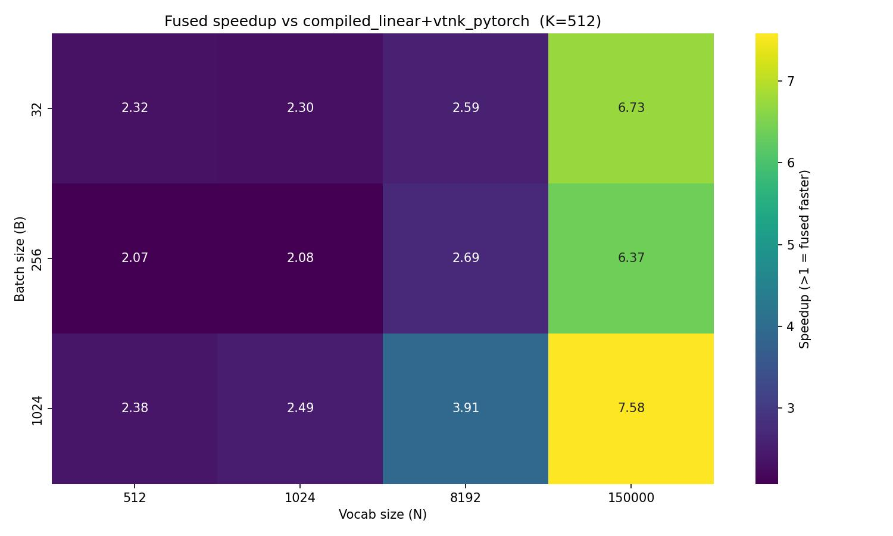
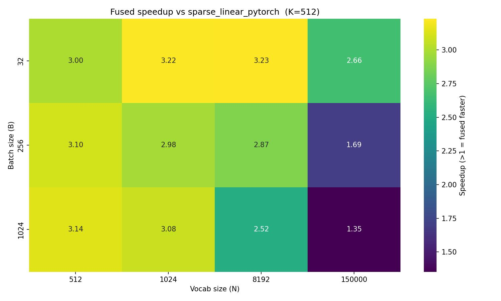
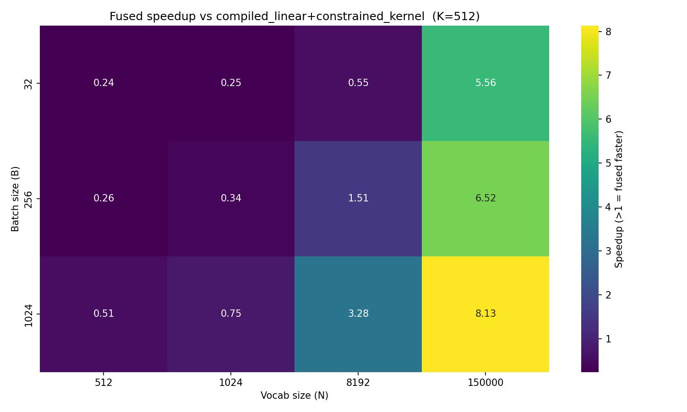
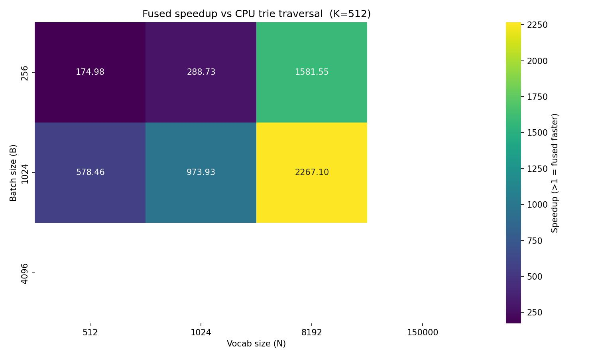

# RecTokens

A tokenizer library for sequential recommendation systems. RecTokens converts continuous item embeddings into discrete multi-level token sequences using **Residual Quantization (RQ)**, enabling large item catalogs to be represented as compact token IDs suitable for autoregressive Transformer-based recommendation models.

## Overview

Modern sequential recommendation models treat item retrieval as a language modeling problem: given a user's interaction history, generate the next item's token sequence autoregressively. RecTokens provides two components for this pipeline:

1. **Tokenizers** — Convert item feature vectors into discrete token sequences (item IDs).
2. **Constrained Decoding** — At inference time, efficiently restrict the model's generation to only valid item token sequences.

### Residual Quantization

RQ encodes a `D`-dimensional embedding as `L` discrete codes, one per level:

```
r_0 = x
code_l, q_l = quantizer_l.encode(r_{l-1})
r_l = r_{l-1} - q_l     (residual)
```

With `K` codes per level and `L` levels, the scheme supports `K^L` unique item IDs. For example, `K=256, L=3` yields 16.7 million possible item IDs.

## Installation

```bash
pip install -e .

# With development dependencies
pip install -e ".[dev]"
```

**Requirements:** Python ≥ 3.10, PyTorch ≥ 2.0, NumPy ≥ 1.24. CUDA is required for constrained decoding with GPU kernels.

## Tokenizers

### RQKMeansTokenizer

Fits codebooks via mini-batch K-means. No training loop required — call `fit_step` on batches of embeddings, then encode.

```python
from rectokens import RQKMeansTokenizer, NumpyDataset
import numpy as np

data = np.random.randn(10_000, 128).astype("float32")
dataset = NumpyDataset(data)

tokenizer = RQKMeansTokenizer(
    num_levels=3,       # number of RQ levels (token sequence length)
    codebook_size=256,  # codes per level
    dim=128,            # embedding dimension
)

for batch in dataset.iter_batches(batch_size=256):
    tokenizer.fit_step(batch)

import torch
features = torch.randn(8, 128)
tokens = tokenizer.encode(features)   # TokenSequence, codes shape: (8, 3)
reconstructed = tokenizer.decode(tokens)  # Tensor shape: (8, 128)

tokenizer.save("tokenizer.pt")
tokenizer = RQKMeansTokenizer.load("tokenizer.pt")
```

### RQVAETokenizer

Learns tokenization end-to-end via an encoder–quantizer–decoder architecture. Uses a Vector Quantization (VQ) objective with EMA codebook updates and a dead-code restart mechanism.

```python
from rectokens import RQVAETokenizer
import torch
import torch.nn.functional as F

tokenizer = RQVAETokenizer(
    input_dim=128,
    latent_dim=64,
    hidden_dim=256,
    num_levels=3,
    codebook_size=256,
    commitment_weight=0.25,
    ema_decay=0.99,
)

optimizer = torch.optim.Adam(tokenizer.parameters(), lr=1e-3)

for batch in data_loader:
    out = tokenizer(batch)
    loss = F.mse_loss(out["recon"], batch) + out["commitment_loss"]
    optimizer.zero_grad()
    loss.backward()
    optimizer.step()

tokenizer._fitted = True
tokenizer.eval()

tokens = tokenizer.encode(features)
reconstructed = tokenizer.decode(tokens)

tokenizer.save("tokenizer.pt")
tokenizer = RQVAETokenizer.load("tokenizer.pt")
```

The `forward` pass returns a dict with keys `recon` (reconstruction), `commitment_loss`, and `codes`.

## Constrained Decoding

At inference time, a recommendation model must generate token sequences that correspond to actual items in the catalog. RecTokens provides a GPU-accelerated trie for this constraint.

### CompactCSRTrie

A trie over all valid item token sequences, stored in Compressed Sparse Row (CSR) format for efficient GPU tensor operations. The first few layers use dense lookup tables for O(1) indexing; deeper layers use sparse CSR traversal.

```python
from rectokens.schemas.compact_csr_trie import CompactCSRTrie

# Build from a TokenSequence of all items
sem_ids = tokenizer.encode(all_item_features)
trie = CompactCSRTrie.from_sorted_batch(
    sem_ids,
    vocab_size=256,
    dense_lookup_layers=2,
)
```

### Autoregressive Generation

```python
from rectokens.decoding.constrained_decoding import autoregressive_generate
from rectokens.schemas.config import GenerationConfig

config = GenerationConfig(
    steps=3,       # token sequence length
    k=10,          # number of items to retrieve
    beam_size=50,  # beam width
    temperature=1.0,
)

# model: any nn.Module whose forward returns logits over the vocab
generated = autoregressive_generate(
    model=model,
    trie=trie,
    input_ids=user_history_ids,
    generation_config=config,
)
# generated shape: (B, k, steps)
```

### Constrained Node Transition

The core primitive for constrained decoding is a masked linear projection. Two implementations are provided:

- **`vtnk_pytorch`** — Pure PyTorch; applies a validity mask to logits before sampling.
- **`fused_linear_constrained_node_transition`** — Custom Triton kernel that fuses the matrix multiply and constraint masking into a single GPU kernel for maximum throughput.

## Performance

The `benchmark_vtnk.py` script benchmarks constrained decoding implementations across batch sizes (`B ∈ {32, 256, 1024}`) and vocabulary sizes (`N ∈ {512, 1024, 8192, 150000}`). The fused Triton kernel provides 10–100× speedup over CPU trie traversal at large vocabulary and batch sizes.

```bash
python benchmark_vtnk.py
# Results saved to out/heatmap_*.jpg
```

### Fused Kernel Speedup Heatmaps

This section benchmarks `fused_linear_constrained_node_transition` — the kernel that fuses the linear projection and CSR trie constraint into a single GPU pass — against four baselines. Each heatmap reports the speedup ratio (values > 1 mean the fused kernel is faster) across batch sizes (B ∈ {32, 256, 1024}) and vocabulary sizes (N ∈ {512, 1024, 8192, 150000}), with hidden dim K=512 fixed.

**Summary of findings.** The fused kernel consistently outperforms all GPU baselines at large vocabulary sizes (N ≥ 8192) and its advantage grows with both N and B. At N=150k the fused kernel is **6–8× faster** than the two-kernel approach (separate matmul + constraint pass) and **6–7.6× faster** than the dense PyTorch baseline, because fusing the linear projection and CSR mask into a single Triton kernel eliminates the intermediate logit buffer and the second kernel-launch overhead — costs that scale directly with N×B. Against sparse PyTorch the advantage is more modest (1.4–3.9×) and narrows at large N + large B, since sparse PyTorch already skips a large fraction of the matmul work; the fused kernel is most effective relative to this baseline at small-to-medium vocab (N ≤ 8192).

At small vocabulary (N ≤ 1024) the fused kernel is **slower** than the two-kernel approach (0.24–0.75×). Here the matmul is small enough that cuBLAS (used by `torch.compile(nn.Linear)`) outperforms the hand-written Triton tile, and the savings from avoiding a second kernel launch do not compensate.

Against CPU trie traversal the fused kernel wins by **17–625×**, with the largest margins at large batch sizes where the CPU baseline scales linearly with B while the GPU kernel processes the entire batch in parallel. The speedup narrows at N=150k (17–95×) as GPU compute time grows, but the fused kernel remains the clear winner across the board.

**vs PyTorch (dense)** — `torch.compile(nn.Linear)` followed by `vtnk_pytorch`, which applies a validity mask to the logits in a separate GPU pass after the matmul.


**vs Sparse PyTorch** — `torch.compile(sparse_linear_pytorch)`, which skips columns corresponding to invalid tokens during the matmul using a sparse weight representation, but remains within the PyTorch runtime.


**vs Custom Kernel** — `torch.compile(nn.Linear)` followed by `constrained_node_transition`, a standalone Triton kernel that applies the CSR trie mask to precomputed logits. The matmul and masking are still two separate kernel launches.


**vs CPU Trie** — Pure Python traversal of an in-memory `Trie` on CPU, iterating over each batch item to collect valid next tokens. Included as the reference baseline for the constrained decoding problem.


## Module Structure

```
rectokens/
├── core/               # Abstract base classes (Tokenizer, Quantizer, Codebook)
├── tokenizers/         # RQKMeansTokenizer, RQVAETokenizer
├── quantizers/         # KMeansQuantizer, ResidualQuantizer
├── codebooks/          # EuclideanCodebook (vectorized L2 nearest-neighbor)
├── decoding/           # vtnk_pytorch, autoregressive_generate, Trie (CPU)
├── schemas/            # CompactCSRTrie, GenerationConfig, GenerationState
├── ops/                # Python wrappers for kernels
├── kernels/            # Triton GPU kernels
├── modules/            # SparseLinear, ConstraintEnforcer (PyTorch modules)
└── datasets.py         # NumpyDataset, TensorDataset
```

## Key Types

| Type | Description |
|------|-------------|
| `TokenSequence` | Output of `encode()`; holds `.codes` tensor of shape `(N, num_levels)` |
| `QuantizerOutput` | Single-level quantizer output: `codes`, `quantized`, `residuals`, `commitment_loss` |
| `ResidualQuantizerOutput` | Multi-level output: `codes` `(B, L)`, `quantized` `(B, D)`, `level_outputs` |
| `GenerationConfig` | Beam search config: `steps`, `k`, `beam_size`, `temperature` |
| `CompactCSRTrie` | GPU-resident CSR trie encoding valid item token sequences |

## References

- Rajput et al. **Recommender Systems with Generative Retrieval.** NeurIPS 2023. https://arxiv.org/abs/2305.05065

- Zhou et al. **OneRec Technical Report.** 2025. https://arxiv.org/abs/2506.13695

- Su et al. **Vectorizing the Trie: Efficient Constrained Decoding for LLM-based Generative Retrieval on Accelerators.** 2026. https://arxiv.org/abs/2602.22647

## License

Apache 2.0